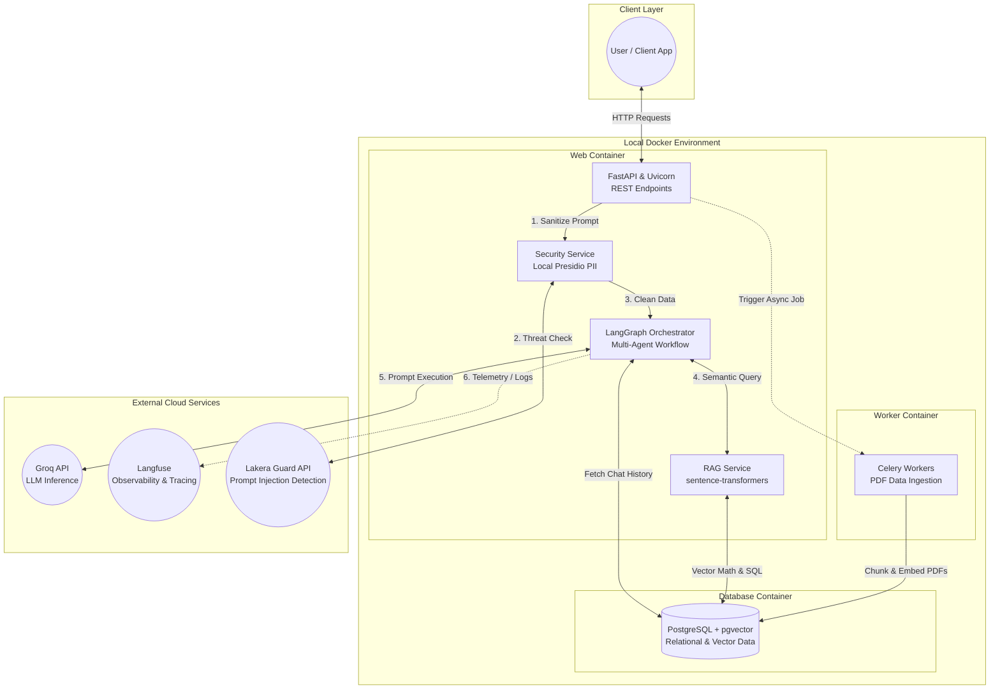
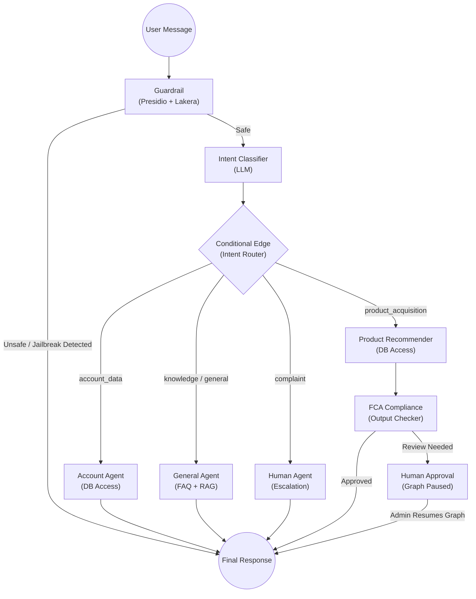

# FCA Multi-Agent Support System

[](https://www.python.org/downloads/)  
[](https://fastapi.tiangolo.com/)  
[](LICENSE)

An intelligent, production-ready customer support system designed for UK financial services.  
It uses a **LangGraph-based multi-agent architecture** with strict **FCA Consumer Duty compliance validation**, PII redaction, and prompt-injection defense.

---

# ✨ Features

## 🤖 Multi-Agent Orchestration (LangGraph)

- Intent classification routes queries to specialized agents  
- Dedicated agents:
  - Account inquiries
  - FAQ / RAG knowledge
  - Product recommendations
  - Human escalation
- Stateful conversation memory via `AgentCoordinator`

---

## 🛡️ FCA Compliance & Security

**Compliance Agent**
- Detects prohibited claims (e.g., “risk-free”)  
- Appends mandatory FCA disclaimers  
- Blocks non-compliant responses  

**Security Guardrails**
- Prompt-injection defense (Lakera Guard)  
- PII detection & redaction (Microsoft Presidio)  

---

## 🚀 High-Performance Backend

- FastAPI async API  
- PostgreSQL + pgvector (relational + vector search)  
- Redis + Celery (cache & background tasks)  
- SQLAlchemy async ORM  

---

## 📊 Observability & Metrics

- Langfuse (LLM tracing)  
- Prometheus (metrics)  
- Structured JSON logging  

---

# 🏗️ System Architecture

This project utilizes an asynchronous microservice architecture containerized via Docker. It is designed to safely route user queries through a multi-agent LLM network while strictly adhering to UK Financial Conduct Authority (FCA) compliance standards.



**Core Components & Data Flow:**

- The Entry Point (FastAPI): All client interactions are handled by a high-performance, asynchronous FastAPI backend served by Uvicorn.

- The Security Gateway (Presidio + Lakera): Before any data reaches an LLM, it passes through the SecurityService. Microsoft Presidio runs locally to detect and mask Personally Identifiable Information (PII). Simultaneously, the prompt is validated against the external Lakera Guard API to detect and block adversarial jailbreak attempts or prompt injections.

- The Orchestrator (LangGraph): The core intelligence of the application. LangGraph manages the stateful workflow, routing the clean prompt to the correct specialized agent (e.g., Intent Classifier, Account Agent, Product Recommender).

- Asynchronous Data Ingestion (Celery): Heavy background operations are offloaded to Celery workers. Specifically, Celery is responsible for ingesting PDF documents, chunking the text, generating vector embeddings, and inserting them into the vector database without blocking the main API.

- The Knowledge Base (PostgreSQL + pgvector): The system uses a single PostgreSQL database for both standard relational data (Users, Accounts, Transactions) and vector embeddings. The RAGService uses local sentence-transformers to perform rapid similarity searches via pgvector to ground LLM responses in real company data.

- The AI Engine (Groq): LLM inference is completely decoupled and handled by the Groq API, allowing for lightning-fast token generation.
  
- The Observer (Langfuse): The entire LangGraph workflow is traced asynchronously by Langfuse, capturing LLM latency, token usage, agent reasoning paths, and evaluation scores in the cloud.

---
## 🤖 LangGraph Multi-Agent Workflow:

The core logic of the application is governed by a Directed Acyclic Graph (DAG) built with LangGraph. Instead of relying on a single monolithic LLM prompt, the system routes the user's query through specialized, isolated nodes.


**The Request Lifecycle:**

1. The Guardrail Node: Every incoming message instantly hits the Guardrail. It scans for PII and prompt injections. If malicious intent is detected, the graph halts execution immediately and routes to END with a safe rejection message, protecting the system.

2. The Intent Classifier: If safe, the message is passed to the Intent LLM. It analyzes the semantic meaning of the text to categorize the user's goal.

3. The Conditional Router: LangGraph dynamically routes the state to the appropriate specialized worker agent:

   - Account Agent: Securely queries PostgreSQL to format account balances and transaction history. Routes directly to END.

   - General Agent: Uses RAG and Database FAQs to answer policy questions. Routes directly to END.

   - Human Agent: Flags the conversation for urgent human intervention. Routes directly to END.

   - Product Recommender: Uses structured Database queries to recommend financial products based on user needs. This is the only agent that routes to the Compliance Node.

4. The FCA Compliance Node: For Product Recommendations, the path routes through the Compliance node. This final agent acts as an output guardrail, verifying that the generated text adheres to UK Financial Conduct Authority rules.

5. Human-in-the-Loop (HITL): If the Compliance Node detects severe policy violations or prohibited language in the product recommendation, it routes to the Human Approval node, which pauses the graph's execution. An administrator must then manually review, edit, and resume the graph to send the final response.

---

# 💻 Tech Stack

**Core**  
- Python 3.11  
- FastAPI  
- Uvicorn  
- Pydantic  

**AI / LLM**  
- Groq API (mixtral-8x7b-32768)  
- LangChain  
- LangGraph  

**Database**  
- PostgreSQL 15  
- pgvector  
- SQLAlchemy (async)  
- Alembic  

**Vector Embeddings**  
- sentence-transformers (all-MiniLM-L6-v2)  
- PyPDF2  

**Task Queue**  
- Celery  
- Redis  

**Security**  
- Microsoft Presidio  
- Lakera Guard  
- passlib  
- python-jose (JWT)  

**Monitoring**  
- Langfuse  
- Prometheus Instrumentator  

**Testing**  
- Pytest  
- pytest-asyncio  
- httpx  

---

# 📁 Project Structure

```text
fca-multi-agent-support/
│
├── app/
│   ├── agents/          # AI agents (Account, General, Product, Compliance, Human, Intent)
│   ├── api/             # API routes & dependencies
│   ├── coordinator/     # Conversation state & memory manager
│   ├── models/          # SQLAlchemy DB models
│   ├── repositories/    # Database CRUD layer
│   ├── routers/         # FastAPI routers
│   ├── schemas/         # Pydantic schemas & workflow states
│   ├── services/        # Business logic (RAG, Security, Customer, Product)
│   ├── workflows/       # LangGraph state machine
│   ├── config.py        # Environment config
│   ├── database.py      # DB engine & session
│   ├── main.py          # FastAPI entrypoint
│   ├── seed_database.py # Test data generator
│   └── worker.py        # Celery worker
│
├── data/                # Source docs (PDFs, FAQs)
├── docs/                # Architecture docs
├── frontend/            # Streamlit UI
├── tests/               # Pytest suite
│
├── .env.example
├── docker-compose.yml
├── Dockerfile
└── requirements.txt
```

---

# 🚀 Quick Start (Docker)

Run the full stack (API, DB, Redis, Worker, Frontend) using Docker Compose.

## 1️⃣ Setup Environment

```bash
git clone <repository_url>
cd fca-multi-agent-support

cp .env.example .env
```

Required `.env` keys:

```
GROQ_API_KEY=
SECRET_KEY=
```

Optional:

```
LANGFUSE_PUBLIC_KEY=
LANGFUSE_SECRET_KEY=
LAKERA_GUARD_API_KEY=
```

---

## 2️⃣ Start Services

```bash
docker-compose up -d --build
```

---

## 3️⃣ Initialize & Seed Database

```bash
docker-compose exec web python -m app.seed_database --clear --customers 100
```

---

## 4️⃣ Background Data Ingestion (RAG)

```bash
docker-compose exec web python -m app.ingest
```

---

## 5️⃣ Access the Application

- API docs → http://localhost:8000/docs  
- Streamlit UI → http://localhost:8501  

---

# 🧩 Core Components

## Agents (`app/agents/`)

**IntentClassifierAgent**  
Routes requests: account, product, FAQ, or human support.

**GeneralAgent**  
RAG-based FAQ & policy responses using pgvector.

**AccountAgent**  
Secure balance & transaction retrieval.

**ProductRecommenderAgent**  
Suggests savings, credit, or loan products.

**ComplianceCheckerAgent**  
Enforces FCA wording & disclaimers.

**HumanAgent**  
Creates escalation tickets with priority levels.

---

## LangGraph Workflow (`app/workflows/message_workflow.py`)

State machine controlling:

1. Guardrail validation  
2. Intent classification  
3. Agent routing  
4. Compliance check  
5. Response formatting  

---

## Security & PII (`app/services/security_service.py`)

**Prompt Injection Defense**
- Heuristic detection  
- Optional Lakera Guard API  

**PII Redaction**
- Presidio analyzer + anonymizer  
- Masks sensitive entities (e.g., card numbers)  

---

# 🧪 Testing & Verification

Run full test suite:

```bash
python verify_full_workflow.py
python verify_evaluation.py
python verify_memory.py
```

Diagnostic scripts:

- `verify_full_workflow.py` → end-to-end LangGraph test  
- `verify_rag.py` → semantic search evaluation  
- `verify_evaluation.py` → adversarial prompt testing  
- `verify_memory.py` → multi-turn context validation  

---

# 📡 API Highlights

**POST** `/api/v1/messages/process`  
Main chat endpoint.

**GET** `/chat/stream`  
Server-sent events streaming.

**POST** `/api/v1/admin/seed-db`  
Trigger DB seeding.

**POST** `/api/v1/admin/upload-background`  
Async PDF ingestion.

**GET** `/api/v1/health`  
System health diagnostics.

---

## 📜 License

This project is licensed under the MIT License - see [LICENSE](LICENSE) file.
