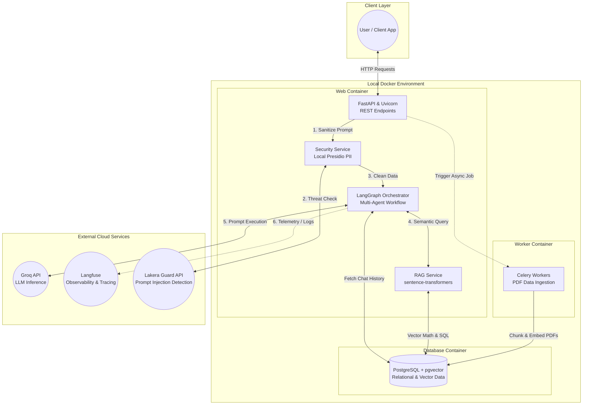
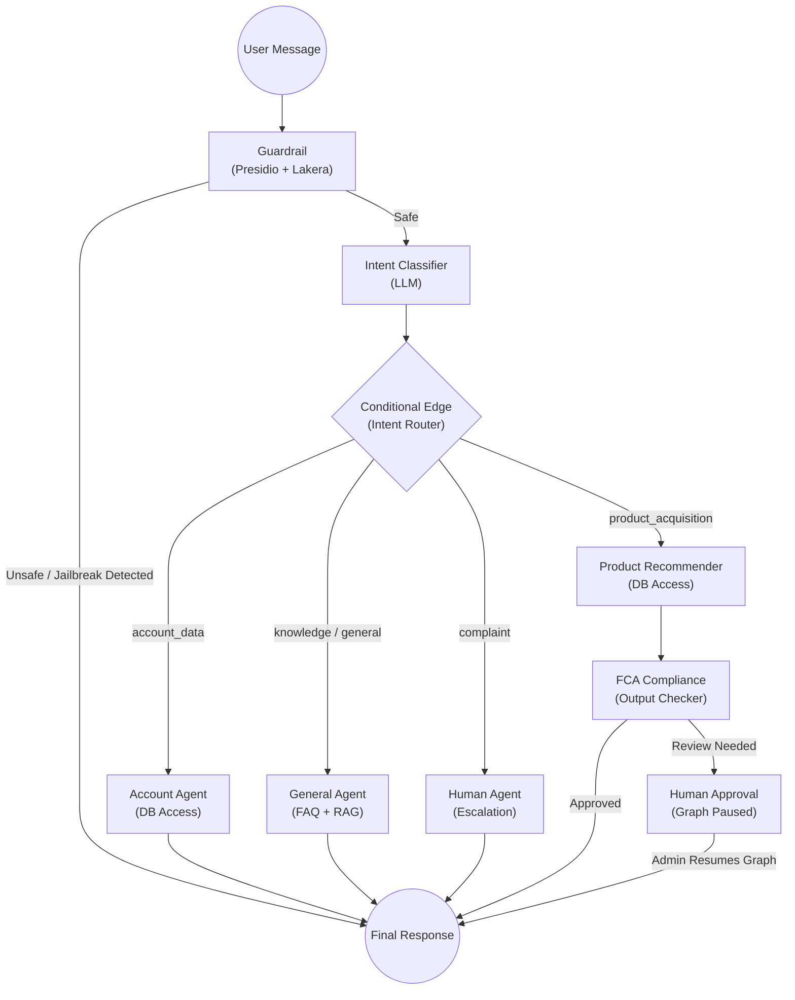
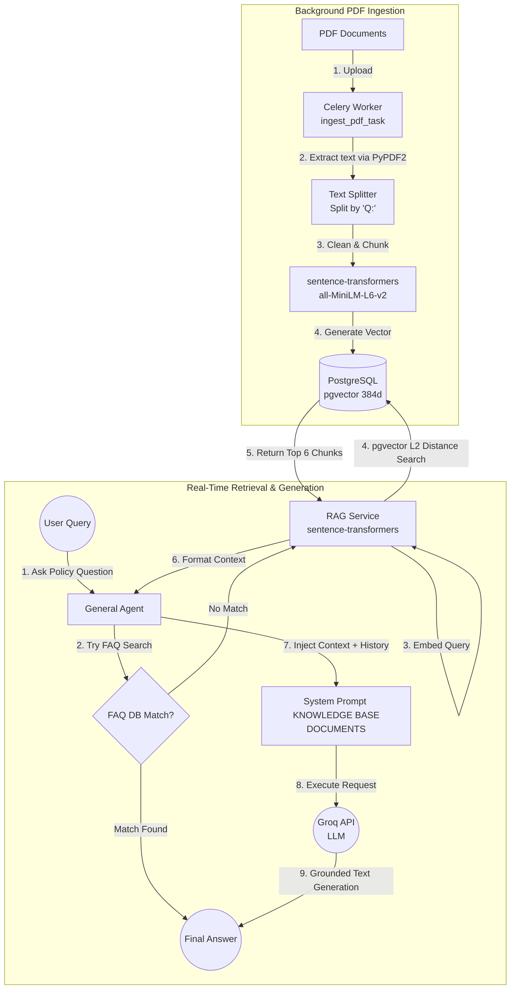
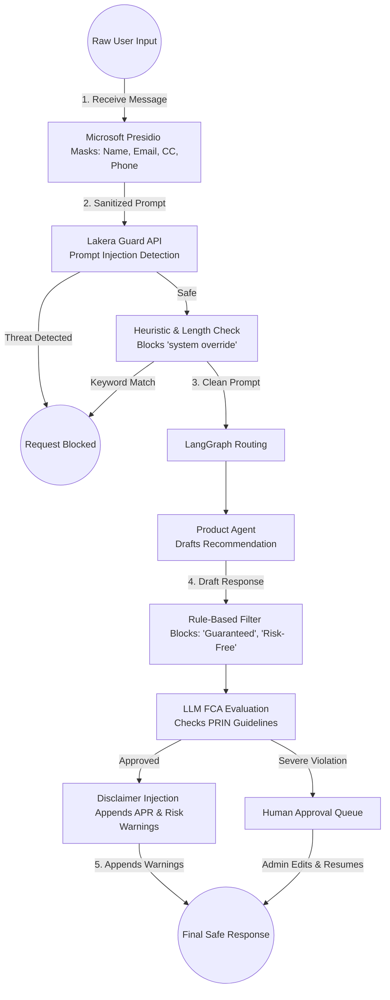
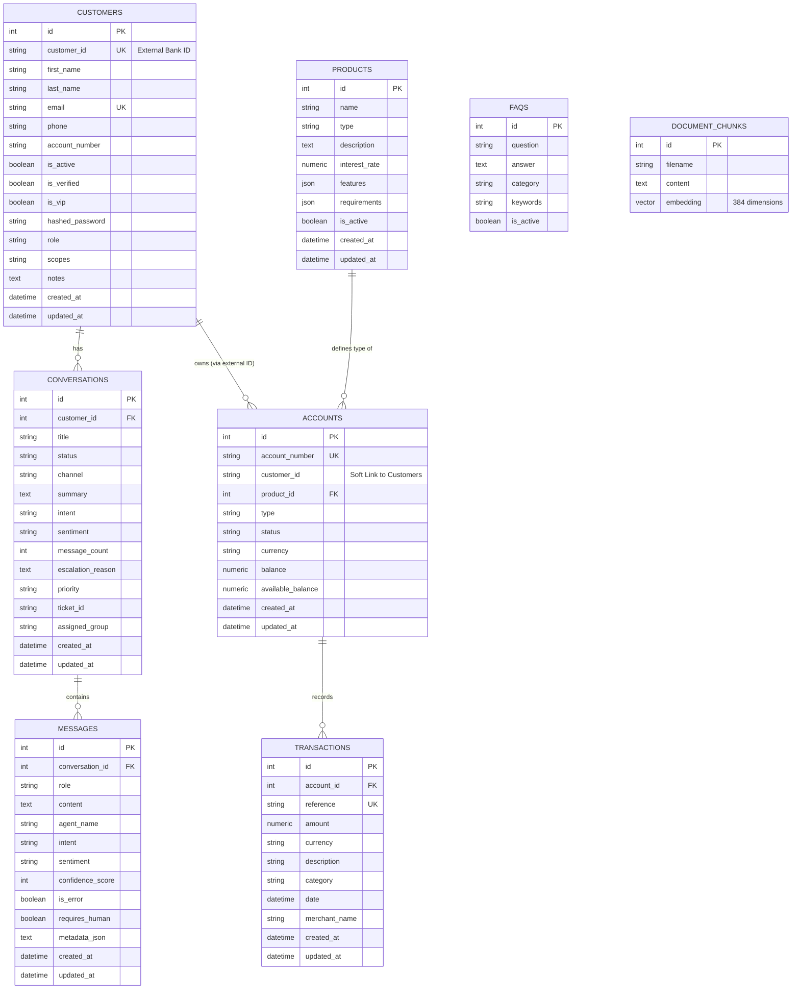
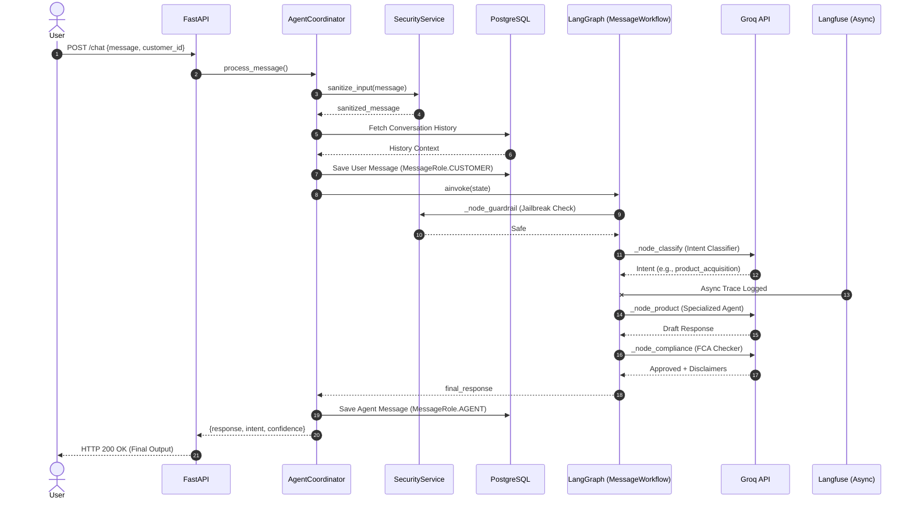

# FCA Multi-Agent Support System

[](https://www.python.org/downloads/)  
[](https://fastapi.tiangolo.com/)  
[](LICENSE)

An intelligent, production-ready customer support system designed for UK financial services.  
It uses a **LangGraph-based multi-agent architecture** with strict **FCA Consumer Duty compliance validation**, PII redaction, and prompt-injection defense.

---

# ✨ Features

## 🤖 Multi-Agent Orchestration (LangGraph)

- Intent classification routes queries to specialized agents  
- Dedicated agents:
  - Account inquiries
  - FAQ / RAG knowledge
  - Product recommendations
  - Human escalation
- Stateful conversation memory via `AgentCoordinator`

---

## 🛡️ FCA Compliance & Security

**Compliance Agent**
- Detects prohibited claims (e.g., “risk-free”)  
- Appends mandatory FCA disclaimers  
- Blocks non-compliant responses  

**Security Guardrails**
- Prompt-injection defense (Lakera Guard)  
- PII detection & redaction (Microsoft Presidio)  

---

## 🚀 High-Performance Backend

- FastAPI async API  
- PostgreSQL + pgvector (relational + vector search)  
- Redis + Celery (cache & background tasks)  
- SQLAlchemy async ORM  

---

## 📊 Observability & Metrics

- Langfuse (LLM tracing)  
- Prometheus (metrics)  
- Structured JSON logging  

---

# 🏗️ System Architecture

This project utilizes an asynchronous microservice architecture containerized via Docker. It is designed to safely route user queries through a multi-agent LLM network while strictly adhering to UK Financial Conduct Authority (FCA) compliance standards.


```mermaid
graph TD
    subgraph Client Layer
        User((User / Client App))
    end

    subgraph Local Docker Environment
        subgraph Web Container
            API[FastAPI & Uvicorn <br> REST Endpoints]
            Security[Security Service <br> Local Presidio PII]
            LangGraph[LangGraph Orchestrator <br> Multi-Agent Workflow]
            RAG[RAG Service <br> sentence-transformers]
        end

        subgraph Worker Container
            Celery[Celery Workers <br> PDF Data Ingestion]
        end

        subgraph Database Container
            PG[(PostgreSQL + pgvector <br> Relational & Vector Data)]
        end
    end

    subgraph External Cloud Services
        Groq((Groq API <br> LLM Inference))
        Langfuse((Langfuse <br> Observability & Tracing))
        Lakera((Lakera Guard API <br> Prompt Injection Detection))
    end

    %% Data Flow Connections
    User <-->|HTTP Requests| API
    
    API -->|1. Sanitize Prompt| Security
    Security <-->|2. Threat Check| Lakera
    Security -->|3. Clean Data| LangGraph
    
    API -.->|Trigger Async Job| Celery
    Celery -->|Chunk & Embed PDFs| PG
    
    LangGraph <-->|4. Semantic Query| RAG
    RAG <-->|Vector Math & SQL| PG
    LangGraph <-->|Fetch Chat History| PG
    
    LangGraph <-->|5. Prompt Execution| Groq
    LangGraph -.->|6. Telemetry / Logs| Langfuse
```

**Core Components & Data Flow:**

- The Entry Point (FastAPI): All client interactions are handled by a high-performance, asynchronous FastAPI backend served by Uvicorn.

- The Security Gateway (Presidio + Lakera): Before any data reaches an LLM, it passes through the SecurityService. Microsoft Presidio runs locally to detect and mask Personally Identifiable Information (PII). Simultaneously, the prompt is validated against the external Lakera Guard API to detect and block adversarial jailbreak attempts or prompt injections.

- The Orchestrator (LangGraph): The core intelligence of the application. LangGraph manages the stateful workflow, routing the clean prompt to the correct specialized agent (e.g., Intent Classifier, Account Agent, Product Recommender).

- Asynchronous Data Ingestion (Celery): Heavy background operations are offloaded to Celery workers. Specifically, Celery is responsible for ingesting PDF documents, chunking the text, generating vector embeddings, and inserting them into the vector database without blocking the main API.

- The Knowledge Base (PostgreSQL + pgvector): The system uses a single PostgreSQL database for both standard relational data (Users, Accounts, Transactions) and vector embeddings. The RAGService uses local sentence-transformers to perform rapid similarity searches via pgvector to ground LLM responses in real company data.

- The AI Engine (Groq): LLM inference is completely decoupled and handled by the Groq API, allowing for lightning-fast token generation.
  
- The Observer (Langfuse): The entire LangGraph workflow is traced asynchronously by Langfuse, capturing LLM latency, token usage, agent reasoning paths, and evaluation scores in the cloud.

---
## 🤖 LangGraph Multi-Agent Workflow:

The core logic of the application is governed by a Directed Acyclic Graph (DAG) built with LangGraph. Instead of relying on a single monolithic LLM prompt, the system routes the user's query through specialized, isolated nodes.


```mermaid
graph TD
  

    %% Nodes
    START((User Message)):::entrypoint
    
    Guardrail["Guardrail <br> (Presidio + Lakera)"]:::security
    Intent["Intent Classifier <br> (LLM)"]:::router
    
    Router{"Conditional Edge <br> (Intent Router)"}:::router
    
    Agent_Account["Account Agent <br> (DB Access)"]:::agent
    Agent_General["General Agent <br> (FAQ + RAG)"]:::agent
    Agent_Human["Human Agent <br> (Escalation)"]:::agent
    Agent_Product["Product Recommender <br> (DB Access)"]:::agent
    
    Compliance["FCA Compliance <br> (Output Checker)"]:::compliance
    HumanApproval["Human Approval <br> (Graph Paused)"]:::human
    
    END((Final Response)):::entrypoint

    %% Data Flow
    START --> Guardrail
    
    Guardrail -- "Unsafe / Jailbreak Detected" --> END
    Guardrail -- "Safe" --> Intent
    
    Intent --> Router
    
    Router -- "account_data" --> Agent_Account
    Router -- "knowledge / general" --> Agent_General
    Router -- "complaint" --> Agent_Human
    Router -- "product_acquisition" --> Agent_Product
    
    %% Non-Product Agents bypass Compliance
    Agent_Account --> END
    Agent_General --> END
    Agent_Human --> END
    
    %% Product Recommendations MUST be checked
    Agent_Product --> Compliance
    
    %% Compliance Routing
    Compliance -- "Approved" --> END
    Compliance -- "Review Needed" --> HumanApproval
    
    HumanApproval -- "Admin Resumes Graph" --> END

```
**The Request Lifecycle:**

1. The Guardrail Node: Every incoming message instantly hits the Guardrail. It scans for PII and prompt injections. If malicious intent is detected, the graph halts execution immediately and routes to END with a safe rejection message, protecting the system.

2. The Intent Classifier: If safe, the message is passed to the Intent LLM. It analyzes the semantic meaning of the text to categorize the user's goal.

3. The Conditional Router: LangGraph dynamically routes the state to the appropriate specialized worker agent:

   - Account Agent: Securely queries PostgreSQL to format account balances and transaction history. Routes directly to END.

   - General Agent: Uses RAG and Database FAQs to answer policy questions. Routes directly to END.

   - Human Agent: Flags the conversation for urgent human intervention. Routes directly to END.

   - Product Recommender: Uses structured Database queries to recommend financial products based on user needs. This is the only agent that routes to the Compliance Node.

4. The FCA Compliance Node: For Product Recommendations, the path routes through the Compliance node. This final agent acts as an output guardrail, verifying that the generated text adheres to UK Financial Conduct Authority rules.

5. Human-in-the-Loop (HITL): If the Compliance Node detects severe policy violations or prohibited language in the product recommendation, it routes to the Human Approval node, which pauses the graph's execution. An administrator must then manually review, edit, and resume the graph to send the final response.

---
## Retrieval-Augmented Generation (RAG) Architecture:

To provide accurate answers regarding company policies and prevent LLM hallucinations, the system uses a local RAG pipeline powered by pgvector and sentence-transformers. The architecture is divided into an asynchronous background ingestion pipeline and a real-time retrieval pipeline.


```mermaid

graph TD

    %% Background Ingestion Flow
    subgraph Background PDF Ingestion
        PDF[PDF Documents]:::worker
        Celery[Celery Worker <br> ingest_pdf_task]:::worker
        TextSplitter[Text Splitter <br> Split by 'Q:']:::worker
        Embed_Worker[sentence-transformers <br> all-MiniLM-L6-v2]:::worker
        DB[(PostgreSQL <br> pgvector 384d)]:::database

        PDF -->|1. Upload| Celery
        Celery -->|2. Extract text via PyPDF2| TextSplitter
        TextSplitter -->|3. Clean & Chunk| Embed_Worker
        Embed_Worker -->|4. Generate Vector| DB
    end

    %% Real-Time User Flow
    subgraph Real-Time Retrieval & Generation
        Query((User Query)):::user
        Agent[General Agent]:::process
        FAQ_Check{FAQ DB Match?}:::process
        Embed_Service[RAG Service <br> sentence-transformers]:::process
        Prompt[System Prompt <br> KNOWLEDGE BASE DOCUMENTS]:::process
        Groq((Groq API <br> LLM)):::llm
        Response((Final Answer)):::user

        Query -->|1. Ask Policy Question| Agent
        Agent -->|2. Try FAQ Search| FAQ_Check
        
        FAQ_Check -- "No Match" --> Embed_Service
        FAQ_Check -- "Match Found" --> Response
        
        Embed_Service -->|3. Embed Query| Embed_Service
        Embed_Service -->|4. pgvector L2 Distance Search| DB
        DB -->|5. Return Top 6 Chunks| Embed_Service
        Embed_Service -->|6. Format Context| Agent
        Agent -->|7. Inject Context + History| Prompt
        Prompt -->|8. Execute Request| Groq
        Groq -->|9. Grounded Text Generation| Response
    end

```

**Background Data Ingestion (Celery)**

To maintain high API performance, document ingestion is offloaded to a Celery background worker running an asyncio event loop.

 - When PDF documents are uploaded, the ingest_pdf_task utilizes PyPDF2 to extract raw text.

 - The RAGService cleans the text of breaking newlines and semantically chunks it by splitting at "Q:" to preserve Question & Answer blocks together.

 - The open-source all-MiniLM-L6-v2 model generates 384-dimensional vector embeddings for each chunk.

 - The text and its corresponding vector are saved into the document_chunks table in PostgreSQL utilizing the pgvector extension.

**Real-Time Retrieval (General Agent)**

When a user asks a policy or knowledge-based question, the GeneralAgent manages the retrieval workflow:

 - The agent first attempts a direct lookup in the FAQService.

 - If no FAQ match is found, the agent passes the user's query to the RAGService.

 - The RAGService embeds the user's query using the all-MiniLM-L6-v2 model and performs a mathematical L2 Distance (<->) similarity search against the PostgreSQL pgvector database.

 - The database returns the top 6 most relevant text chunks.

 - The GeneralAgent formats these chunks under a KNOWLEDGE BASE DOCUMENTS: header.

 - This context, along with the conversation history, is injected into the system prompt and sent to the Groq LLM API, instructing the model to formulate its answer using only the provided documents.

---
## Enterprise Security & FCA Compliance Pipeline

Because this system operates within the UK Financial Services sector, it implements a dual-layered security architecture: Input Guardrails to protect the AI, and Output Guardrails to protect the customer.


```mermaid

graph TD


    %% Input Flow
    Input((Raw User Input)):::input
    PII[Microsoft Presidio <br> Masks: Name, Email, CC, Phone]:::presidio
    Lakera[Lakera Guard API <br> Prompt Injection Detection]:::lakera
    Heuristics[Heuristic & Length Check <br> Blocks 'system override']:::lakera
    Rejected((Request Blocked)):::lakera

    %% AI Execution
    LangGraph[LangGraph Routing]:::agent
    Agent[Product Agent <br> Drafts Recommendation]:::agent

    %% Output Flow
    Rules[Rule-Based Filter <br> Blocks: 'Guaranteed', 'Risk-Free']:::fca
    FCACheck[LLM FCA Evaluation <br> Checks PRIN Guidelines]:::fca
    Disclaimers[Disclaimer Injection <br> Appends APR & Risk Warnings]:::fca
    Human[Human Approval Queue]:::human
    Output((Final Safe Response)):::input

    %% Data Flow Routing
    Input -->|1. Receive Message| PII
    PII -->|2. Sanitized Prompt| Lakera
    
    Lakera -- "Threat Detected" --> Rejected
    Lakera -- "Safe" --> Heuristics
    Heuristics -- "Keyword Match" --> Rejected
    
    Heuristics -->|3. Clean Prompt| LangGraph
    LangGraph --> Agent
    
    Agent -->|4. Draft Response| Rules
    Rules --> FCACheck
    
    FCACheck -- "Severe Violation" --> Human
    FCACheck -- "Approved" --> Disclaimers
    
    Disclaimers -->|5. Appends Warnings| Output
    Human -- "Admin Edits & Resumes" --> Output

```

**Layer 1: Input Guardrails (Protecting the System)**
Before any user message reaches an LLM, it is intercepted by the SecurityService.

 - Data Privacy (Microsoft Presidio): The system uses NLP via presidio-analyzer to detect sensitive PII (Emails, Phone Numbers, Credit Cards, Names) and replaces them with safe tokens (e.g., [EMAIL], [CONFIDENTIAL_DATA]) to prevent data leakage into the LLM context window.

 - Adversarial Defense (Lakera Guard): The sanitized prompt is sent to the Lakera Guard API to detect sophisticated prompt injections, jailbreaks, and role-play attacks.

 - Heuristic Fallback: A final fast-pass heuristic checks for financial crime keywords (e.g., "launder money") and enforces strict character limits.

**Layer 2: Output Guardrails (Protecting the Customer)**
If an agent generates a financial product recommendation, the drafted response is intercepted by the ComplianceCheckerAgent.

 - Prohibited Language Check: The text is scanned against a hardcoded dictionary to block illegal marketing terms like "100% safe", "risk-free", or "guaranteed".

 - FCA Principles Evaluation: A dedicated LLM evaluates the response against core UK Financial Conduct Authority principles, ensuring the communication is "clear, fair, and not misleading".

 - Dynamic Disclaimer Injection: Based on the detected product type (e.g., Investments, Credit), the system automatically appends legally mandated warnings such as "Representative APR - your rate may differ" or "Investments can go down as well as up".

 - Human-in-the-Loop (HITL): If a severe violation is detected, the graph automatically pauses and routes the conversation to a human administrator for manual review and editing.


---
## Database Entity Relationship Architecture

The application utilizes an asynchronous PostgreSQL database via SQLAlchemy, unified under a single schema but logically separated into three distinct data domains.


```mermaid


erDiagram
    %% Core Banking Domain
    CUSTOMERS {
        int id PK
        string customer_id UK "External Bank ID"
        string first_name
        string last_name
        string email UK
        string phone
        string account_number
        boolean is_active
        boolean is_verified
        boolean is_vip
        string hashed_password
        string role
        string scopes
        text notes
        datetime created_at
        datetime updated_at
    }

    ACCOUNTS {
        int id PK
        string account_number UK
        string customer_id "Soft Link to Customers"
        int product_id FK
        string type
        string status
        string currency
        numeric balance
        numeric available_balance
        datetime created_at
        datetime updated_at
    }

    TRANSACTIONS {
        int id PK
        int account_id FK
        string reference UK
        numeric amount
        string currency
        string description
        string category
        datetime date
        string merchant_name
        datetime created_at
        datetime updated_at
    }

    PRODUCTS {
        int id PK
        string name
        string type
        text description
        numeric interest_rate
        json features
        json requirements
        boolean is_active
        datetime created_at
        datetime updated_at
    }

    %% AI Conversation Domain
    CONVERSATIONS {
        int id PK
        int customer_id FK
        string title
        string status
        string channel
        text summary
        string intent
        string sentiment
        int message_count
        text escalation_reason
        string priority
        string ticket_id
        string assigned_group
        datetime created_at
        datetime updated_at
    }

    MESSAGES {
        int id PK
        int conversation_id FK
        string role
        text content
        string agent_name
        string intent
        string sentiment
        int confidence_score
        boolean is_error
        boolean requires_human
        text metadata_json
        datetime created_at
        datetime updated_at
    }

    %% Knowledge Base Domain
    FAQS {
        int id PK
        string question
        text answer
        string category
        string keywords
        boolean is_active
    }

    DOCUMENT_CHUNKS {
        int id PK
        string filename
        text content
        vector embedding "384 dimensions"
    }

    %% Relationships
    CUSTOMERS ||--o{ CONVERSATIONS : "has"
    CONVERSATIONS ||--o{ MESSAGES : "contains"
    
    %% Soft link: Account uses external string customer_id, not internal int ID
    CUSTOMERS ||--o{ ACCOUNTS : "owns (via external ID)"
    
    PRODUCTS ||--o{ ACCOUNTS : "defines type of"
    ACCOUNTS ||--o{ TRANSACTIONS : "records"

```

**AI Chat & Memory Domain (conversations, messages)**
  - Tracks multi-turn chat sessions and individual messages.
  - Each message stores crucial AI metadata, including the executing agent_name, detected intent, sentiment, and confidence_score.
  - The conversations table manages stateful data such as status (Active, Resolved, Escalated), total message_count, and human-in-the-loop escalation data (ticket_id, assigned_group).
  
**Core Banking Domain (customers, accounts, transactions, products)**
  - Represents the read-only or transactional systems integrated from external banking APIs.
  - Important Design Note: Notice that the accounts table uses an external string customer_id rather than the internal integer id. This is a microservice best practice, mimicking how a real AI service would link to a decoupled legacy banking system.
  - The products table serves as the structured catalog for the ProductRecommenderAgent, storing JSON arrays for features and requirements.
  
**Knowledge & RAG Domain (faqs, document_chunks)**
  - Serves as the ground truth for the GeneralAgent.
  - faqs handles standard QA pairs, while document_chunks utilizes PostgreSQL's pgvector extension to store 384-dimensional mathematical arrays alongside the text context parsed from PDF policies.

---
## Sequence Diagram


```mermaid
sequenceDiagram
    autonumber
    actor User
    participant API as FastAPI
    participant Coord as AgentCoordinator
    participant Sec as SecurityService
    participant DB as PostgreSQL
    participant Graph as LangGraph (MessageWorkflow)
    participant LLM as Groq API
    participant Langfuse as Langfuse (Async)

    User->>API: POST /chat {message, customer_id}
    API->>Coord: process_message()
    
    %% Security Phase
    Coord->>Sec: sanitize_input(message)
    Sec-->>Coord: sanitized_message
    
    %% DB State Loading
    Coord->>DB: Fetch Conversation History
    DB-->>Coord: History Context
    Coord->>DB: Save User Message (MessageRole.CUSTOMER)
    
    %% Graph Execution
    Coord->>Graph: ainvoke(state)
    
    Graph->>Sec: _node_guardrail (Jailbreak Check)
    Sec-->>Graph: Safe
    
    Graph->>LLM: _node_classify (Intent Classifier)
    LLM-->>Graph: Intent (e.g., product_acquisition)
    Langfuse-xGraph: Async Trace Logged
    
    Graph->>LLM: _node_product (Specialized Agent)
    LLM-->>Graph: Draft Response
    
    Graph->>LLM: _node_compliance (FCA Checker)
    LLM-->>Graph: Approved + Disclaimers
    
    Graph-->>Coord: final_response
    
    %% DB Save & Return
    Coord->>DB: Save Agent Message (MessageRole.AGENT)
    Coord-->>API: {response, intent, confidence}
    API-->>User: HTTP 200 OK (Final Output)
```


---

# 💻 Tech Stack

**Core**  
- Python 3.11  
- FastAPI  
- Uvicorn  
- Pydantic  

**AI / LLM**  
- Groq API (mixtral-8x7b-32768)  
- LangChain  
- LangGraph  

**Database**  
- PostgreSQL 15  
- pgvector  
- SQLAlchemy (async)  
- Alembic  

**Vector Embeddings**  
- sentence-transformers (all-MiniLM-L6-v2)  
- PyPDF2  

**Task Queue**  
- Celery  
- Redis  

**Security**  
- Microsoft Presidio  
- Lakera Guard  
- passlib  
- python-jose (JWT)  

**Monitoring**  
- Langfuse  
- Prometheus Instrumentator  

**Testing**  
- Pytest  
- pytest-asyncio  
- httpx  

---

# 📁 Project Structure

```text
fca-multi-agent-support/
│
├── app/
│   ├── agents/          # AI agents (Account, General, Product, Compliance, Human, Intent)
│   ├── api/             # API routes & dependencies
│   ├── coordinator/     # Conversation state & memory manager
│   ├── models/          # SQLAlchemy DB models
│   ├── repositories/    # Database CRUD layer
│   ├── routers/         # FastAPI routers
│   ├── schemas/         # Pydantic schemas & workflow states
│   ├── services/        # Business logic (RAG, Security, Customer, Product)
│   ├── workflows/       # LangGraph state machine
│   ├── config.py        # Environment config
│   ├── database.py      # DB engine & session
│   ├── main.py          # FastAPI entrypoint
│   ├── seed_database.py # Test data generator
│   └── worker.py        # Celery worker
│
├── data/                # Source docs (PDFs, FAQs)
├── docs/                # Architecture docs
├── frontend/            # Streamlit UI
├── tests/               # Pytest suite
│
├── .env.example
├── docker-compose.yml
├── Dockerfile
└── requirements.txt
```

---

# 🚀 Quick Start (Docker)

Run the full stack (API, DB, Redis, Worker, Frontend) using Docker Compose.

## 1️⃣ Setup Environment

```bash
git clone <repository_url>
cd fca-multi-agent-support

cp .env.example .env
```

Required `.env` keys:

```
GROQ_API_KEY=
SECRET_KEY=
```

Optional:

```
LANGFUSE_PUBLIC_KEY=
LANGFUSE_SECRET_KEY=
LAKERA_GUARD_API_KEY=
```

---

## 2️⃣ Start Services

```bash
docker-compose up -d --build
```

---

## 3️⃣ Initialize & Seed Database

```bash
docker-compose exec web python -m app.seed_database --clear --customers 100
```

---

## 4️⃣ Background Data Ingestion (RAG)

```bash
docker-compose exec web python -m app.ingest
```

---

## 5️⃣ Access the Application

- API docs → http://localhost:8000/docs  
- Streamlit UI → http://localhost:8501  

---

# 🧩 Core Components

## Agents (`app/agents/`)

**IntentClassifierAgent**  
Routes requests: account, product, FAQ, or human support.

**GeneralAgent**  
RAG-based FAQ & policy responses using pgvector.

**AccountAgent**  
Secure balance & transaction retrieval.

**ProductRecommenderAgent**  
Suggests savings, credit, or loan products.

**ComplianceCheckerAgent**  
Enforces FCA wording & disclaimers.

**HumanAgent**  
Creates escalation tickets with priority levels.

---

## LangGraph Workflow (`app/workflows/message_workflow.py`)

State machine controlling:

1. Guardrail validation  
2. Intent classification  
3. Agent routing  
4. Compliance check  
5. Response formatting  

---

## Security & PII (`app/services/security_service.py`)

**Prompt Injection Defense**
- Heuristic detection  
- Optional Lakera Guard API  

**PII Redaction**
- Presidio analyzer + anonymizer  
- Masks sensitive entities (e.g., card numbers)  

---

# 🧪 Testing & Verification

This project uses `pytest` for comprehensive unit and integration testing across the multi-agent architecture. Tests run against the real PostgreSQL database and Groq API to ensure production-level accuracy.

### Run the Test Suite
To execute the entire test suite with verbose output:
```bash
pytest tests/ -v
```

### Agent & Service Unit Tests

Validates the isolated logic, database interactions, prompt generation, and expected outputs of each specialized component.

 - `./tests/test_intent_classifier.py` — Validates few-shot intent routing across various scenarios (product acquisition, account data, complaints), tests context-aware memory overrides (e.g., forcing a general inquiry based on previous turns), and ensures graceful error fallbacks for invalid frontend data.

 - `./tests/test_account_agent.py` — Tests database queries for balance extraction, transaction history formatting, statement generation, and account details.

 - `./tests/test_general_agent.py` — Validates simple FAQ DB retrieval, pgvector RAG document search, Redis semantic caching, and safe refusal logic for unknown topics.

 - `./tests/test_product_agent.py` — Uses an advanced hybrid asserter (LLM Judge + exact keywords) to validate structured product recommendations, enforces strict eligibility constraints (e.g., rejecting deposits below the minimum balance), and verifies accurate economic reasoning (e.g., tracker mortgage rate adjustments).

 - `./tests/test_compliance_checker.py` — Checks fast heuristic short-circuits (e.g., blocking "risk-free"), LLM compliance evaluations, false-positive handling, and deterministic FCA disclaimer injection.

 - `./tests/test_human_agent.py` — Validates emergency fast-path routing (fraud), priority assignment, missing input handling, and graceful degradation during simulated DB outages.

 - `./tests/test_rag_search.py` — Validates the pgvector database and SentenceTransformer embeddings by running parameterized semantic searches against 40+ FAQ test cases.

### Workflow & Orchestration Tests

Verifies the LangGraph state machine, memory checkpointer, security firewalls, and multi-agent handoffs.

 - `./tests/test_coordinator1.py` — Tests the AgentCoordinator's ability to process messages dynamically, maintain state, aggregate system statistics, and retrieve conversation history.

 - `./tests/test_coordinator2.py` — Verifies real security guardrail blocking for prompt injections, admin Human-in-the-Loop (HITL) interventions, and escalation ticket resolution in the DB.

 - `./tests/test_coordinator3.py` — Tests failure recovery, ensuring safe DB transaction rollbacks on crashes, and proper rejection of invalid admin interventions.

 - `./tests/test_full_workflow1.py` — Tests end-to-end LangGraph execution for normal routing paths and verifies the native checkpointer pauses correctly for human escalations.

 - `./tests/test_full_workflow2.py` — Validates edge-case workflow routing, specifically testing the system's firewall against financial traps and malicious jailbreak attempts.


---

# 📡 API Highlights

**POST** `/api/v1/messages/process`  
Main chat endpoint.

**GET** `/chat/stream`  
Server-sent events streaming.

**POST** `/api/v1/admin/seed-db`  
Trigger DB seeding.

**POST** `/api/v1/admin/upload-background`  
Async PDF ingestion.

**GET** `/api/v1/health`  
System health diagnostics.

---

## 📜 License

This project is licensed under the MIT License - see [LICENSE](LICENSE) file.
